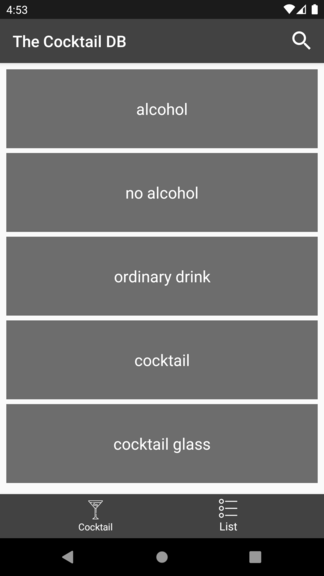
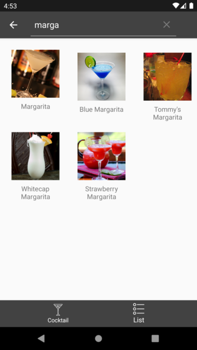

# TheCocktailDB

**Disclaimer**: The application **IS NOT GOING TO BE released on Google Play Store**. For this reason, the API key used is "1" as specified in the [TheCocktailDB API documentation](https://www.thecocktaildb.com/api.php)

## Application description

This application presents information about different cocktails to the user. The information is obtained from the [TheCocktailDB API](https://www.thecocktaildb.com/api.php) by using retrofit for the REST calls.

There are two main sections to explore:

### Cocktail screen

This screen is what the user sees when the application is started, it contains information about the desired cocktail. The cocktail is shown is chosen randomly. This includes:

* Name
* Photo
* Type of drink
* Ingredients
* Instructions

It also provides the option to share the cocktail and get a different one (random)

### Cocktail category screen

This screen presents a list of cocktails categories and also provides the option to search for a specific drink by its name. The option of search by ingredients will be added in the future.

## Application technical details

In this section, the technical details about the app are going to be discussed.

### Architecture

The application contains 1 Activity and some fragments. For the navigation between the different fragments, the Navigation Component has been used.

The architecture followed is the Model-View-ViewModel (MVVM). The app has 1 ViewModel, 1 Repository, and 1 class (MainController) in order to get the necessary data. The flow is the following:

The ViewModel class has an instance of the Repository class. This last one has an instance of the MainController class, which is in charge of calling to TheCocktailDB API GET methods by using retrofit.

### Data

The cocktail data is obtained in run time performing calls to the TheCocktailDB API GET methods using retrofit.

There is not data stored in the device. This may change in the future.

## Testing

The application contains JUnit testing for testing the MainController and Repository classes. The ViewModel class has not associated testing because it only calls to Repository methods that have been already testing. It would be duplicate code, which doesn't seem right.

Instrumented testing will be added soon.

## Screenshots

 
 
## Libraries

* [Retrofit](https://github.com/square/retrofit)
* [Navigation Component](https://developer.android.com/guide/navigation/navigation-getting-started)
* [Picasso](https://github.com/square/picasso)
* [RecyclerView Margin Decoration](https://github.com/TheKhaeng/recycler-view-margin-decoration)

### Logos

* Dice logo from: 
Icons made by <a href="https://www.flaticon.com/free-icon/dices_2927933?term=dice&page=1&position=14" title="Good Ware">Good Ware</a> from <a href="https://www.flaticon.com/" title="Flaticon">www.flaticon.com</a>

* Cocktail logo from: 
Icons made by <a href="http://www.freepik.com/" title="Freepik">Freepik</a> from <a href="https://www.flaticon.com/" title="Flaticon">www.flaticon.com</a>

* List logo from: 
Icons made by <a href="https://www.flaticon.com/authors/kiranshastry" title="Kiranshastry">Kiranshastry</a> from <a href="https://www.flaticon.com/" title="Flaticon">www.flaticon.com</a>
